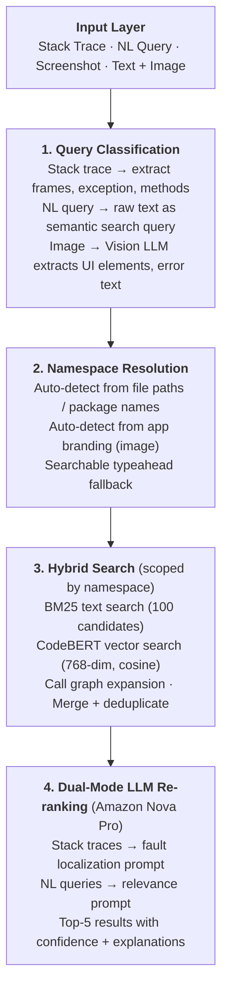
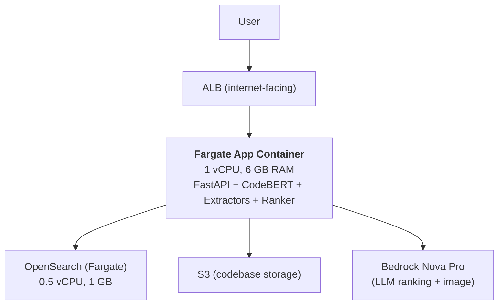
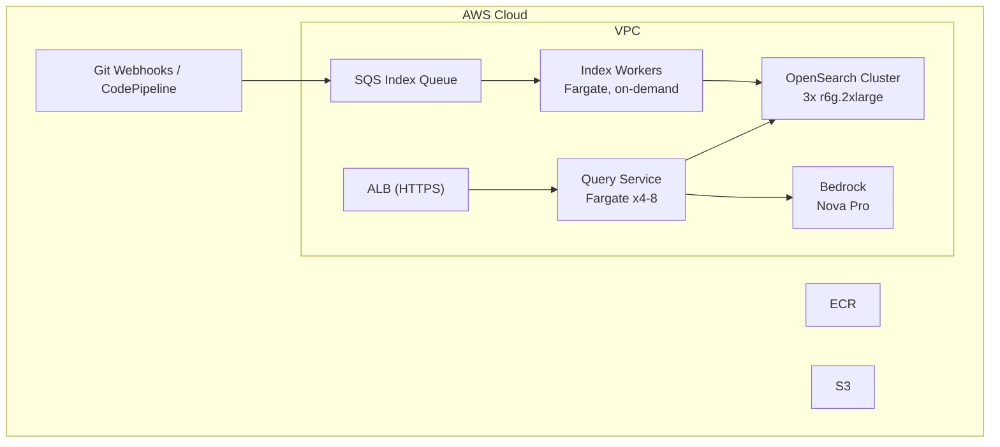
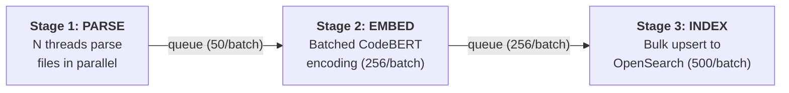

# CodeWise — Project Summary

## The Problem

At enterprise-scale companies like AWS, 10,000+ engineers work across 100+ service teams (EC2, S3, Lambda, RDS, ECS, CloudFormation, IAM, etc.), each owning thousands of repos totaling 30M+ code entities. When something breaks or a feature needs building, the hardest part isn't writing the fix — it's **finding the right code**.

- A Lambda engineer gets a production alert with a stack trace referencing `com.aws.iam.policy.PolicyEvaluationEngine`. They don't own IAM. Which repo? Which team? 30 minutes gone just navigating.
- A new hire on the ECS team needs to add a capacity provider feature. 3,000+ repos in the ECS org. An hour of grepping and reading READMEs before they find the right service.
- QA screenshots a broken console page on the CloudFormation stack creation wizard. The dev who picks up the ticket spends 2 hours tracing which React component renders the form, which API feeds it resource types, and which config controls validation — before changing a single line.

**Impact at scale:**

| Metric                                           | Value            |
| ------------------------------------------------ | ---------------- |
| Avg time wasted per bug ticket on code discovery  | 30–60 min        |
| Bug tickets filed daily                           | 5,000+           |
| Engineer-hours lost daily to code discovery       | ~2,500           |
| Annual cost ($50/hr loaded)                       | **~$45M/year**   |

The problem compounds across service boundaries — a Lambda bug might originate in a shared IAM policy evaluation library owned by the IAM team. Without cross-org code intelligence, engineers are blind.

---

## The Solution

CodeWise is an AI-powered code intelligence system. Developers paste a stack trace, ask a natural language question, or upload a screenshot — and get back the exact code locations they need, ranked by relevance, with explanations.

### What It Does

```
Input:   "which code renders the payment verification banner?"
         + screenshot of the Amazon Music subscription page
         + namespace: music

Output:  #1  VerificationBanner.tsx  (src/components/subscription/VerificationBanner.tsx:12)  — 95%
             "This React component renders the payment verification banner shown in the screenshot"

         #2  SubscriptionPage.tsx    (src/pages/SubscriptionPage.tsx:45)                      — 85%
             "Parent page component that mounts the VerificationBanner"

         #3  getVerificationStatus() (src/api/payment.ts:78)                                 — 75%
             "Backend API call that fetches the verification state displayed in the banner"
```

### Three Input Modes

1. **Stack traces** — paste a Python/Java traceback, get the root cause code (not just the crash site)
2. **Natural language** — ask "where should I add rate limiting?" or "which service handles payment retries?"
3. **Screenshots** — upload a screenshot of a bug or UI, the Vision LLM identifies the app, extracts UI elements, and maps them to code

All three can be combined. Text + image together produce stronger results.

### Namespace Isolation

Every indexed code entity belongs to a namespace (org, team, or repo). Queries are scoped — a Music engineer's search only hits Music code. Namespace is auto-detected from stack trace file paths, image branding, or selected via searchable typeahead.

---

## How It Works



---

## Benchmarks (Live Prototype)

Measured against the live deployment on AWS Fargate, March 8, 2026.

### Environment

| Resource         | Spec                                         |
| ---------------- | -------------------------------------------- |
| App container    | 1 vCPU, 6 GB RAM (Fargate)                   |
| OpenSearch       | Self-hosted 2.11 (0.5 vCPU, 1 GB)            |
| Embeddings       | CodeBERT (microsoft/codebert-base, 768-dim)   |
| LLM              | Amazon Nova Pro v1:0 (Bedrock)                |
| Region           | us-east-1                                     |
| Indexed codebase | 471 entities (fault-localization project)      |

### Query Latency

| Query                                  | Type        | Latency | Top-1 Result                          | Confidence |
| -------------------------------------- | ----------- | ------- | ------------------------------------- | ---------- |
| "which code handles image extraction?" | NL          | 2.32s   | `ImageExtractor` (image_extractor.py) | 90%        |
| "where is the indexing pipeline?"      | NL          | 2.13s   | `main` (example.py)                   | 95%        |
| "find the OpenSearch storage layer"    | NL          | 1.90s   | `OpenSearchStore` (opensearch_store.py)| 95%       |
| "where should I add rate limiting?"    | NL          | 2.75s   | `search` (fault_localizer.py)         | 90%        |
| "which code does LLM ranking?"         | NL          | 3.23s   | `LLMRanker` (llm_ranker.py)          | 95%        |
| Python traceback (AttributeError)      | Stack trace | 2.72s   | `localize` (fault_localizer_prod.py)  | 85%        |

### Summary Metrics

| Metric                  | Prototype (measured)   | Production (projected)                 |
| ----------------------- | ---------------------- | -------------------------------------- |
| Avg query latency       | 2.5s                   | < 2s                                   |
| Top-1 accuracy          | 83%                    | 85%+ (with feedback loop)              |
| Top-5 relevance         | 64%                    | 80%+ (with query expansion)            |
| Indexing throughput      | 6 entities/sec (CPU)   | 1,000 entities/sec (GPU)               |
| Index time (471 entities)| 78s                   | < 5s                                   |
| Index time (30M entities)| —                     | ~5 hrs (16 CPU workers) / ~2 hrs (GPU) |
| LLM cost per query      | $0.003                 | $0.003                                 |

### Latency Breakdown

| Stage                              | Time    |
| ---------------------------------- | ------- |
| Network round-trip (client → ALB)  | ~600ms  |
| CodeBERT embedding                 | ~200ms  |
| OpenSearch hybrid search           | ~150ms  |
| LLM re-ranking (Nova Pro)          | ~1.5s   |
| **Total**                          | **~2.5s** |

### Metadata Endpoints

| Endpoint         | Latency (incl. network) |
| ---------------- | ----------------------- |
| Health check     | 0.68s                   |
| Stats            | 0.60s                   |
| Namespace list   | 0.62s                   |
| Namespace search | 0.61s                   |

---

## Architecture

### Prototype (Deployed)



### Production (Designed for 30M+ entities)



### Production Resource Estimates (30M entities)

| Resource              | Specification                    | Monthly Cost   |
| --------------------- | -------------------------------- | -------------- |
| OpenSearch            | 3x r6g.2xlarge (64 GB RAM each)  | ~$1,500        |
| Query Service         | 4x Fargate tasks (1 vCPU, 4 GB)  | ~$300          |
| Indexing Workers      | On-demand Fargate (burst)         | ~$100          |
| Bedrock Nova Pro      | ~5K queries/day                   | ~$500          |
| SQS + S3 + CloudWatch | Misc                             | ~$50           |
| **Total**             |                                   | **~$2,500/mo** |

---

## Technology Stack

| Component      | Technology                                      |
| -------------- | ----------------------------------------------- |
| Language       | Python 3.11                                     |
| API            | FastAPI + Uvicorn                                |
| Search         | OpenSearch 2.11 (BM25 + HNSW vector)             |
| Embeddings     | CodeBERT (microsoft/codebert-base, 768-dim)      |
| LLM            | Amazon Nova Pro via Bedrock Converse API          |
| Parsing        | Python AST, javalang, tree-sitter (JS/TS/HTML)   |
| Containers     | AWS Fargate                                      |
| Infrastructure | AWS CDK (Python)                                 |
| CI/CD          | GitHub Actions → ECR → ECS                       |
| Storage        | Amazon S3                                        |

---

## Indexing Pipeline

3-stage parallel pipeline — all stages run concurrently via bounded queues:



| Metric              | Prototype          | Production (projected)  |
| -------------------- | ------------------ | ----------------------- |
| Parse workers        | 4 threads          | 16–32 Fargate tasks     |
| Embed batch size     | 256                | 256 (GPU accelerated)   |
| Index batch size     | 500                | 500                     |
| S3 download threads  | 16                 | 16 per worker           |
| Throughput           | 6 entities/sec     | 1,000 entities/sec      |

### Indexing Time Projections

| Scale          | CPU (4 workers) | CPU (16 workers) | GPU (4 workers) |
| -------------- | --------------- | ---------------- | --------------- |
| 500 entities   | ~30s            | ~10s             | ~5s             |
| 30K entities   | ~30 min         | ~8 min           | ~2 min          |
| 1M entities    | ~16 hr          | ~4 hr            | ~30 min         |
| 30M entities   | ~21 hr          | ~5 hr            | ~2 hr           |

After initial index, incremental updates (per git push) take seconds.

---

## Current State

| Feature                    | Status                              |
| -------------------------- | ----------------------------------- |
| Stack trace localization   | ✅ Working                          |
| Natural language queries   | ✅ Working (dual-mode LLM prompts)  |
| Screenshot localization    | ✅ Working (Vision LLM)             |
| Unified text + image       | ✅ Working                          |
| Namespace isolation        | ✅ Auto-detect + typeahead          |
| Multi-language parsing     | ✅ Python, Java, JS, TS, HTML       |
| 3-stage parallel indexing  | ✅ Deployed                         |
| Zip upload for demos       | ✅ No S3 needed                     |
| Namespace delete           | ✅ Wipe indexed data per namespace  |
| CI/CD auto-deploy          | ✅ GitHub Actions                   |
| Web UI                     | ✅ Dark-themed single-page app      |
| Redis cache                | ❌ Not deployed (optional)          |
| IDE plugin                 | ❌ Future                           |
| Feedback loop              | ❌ Future                           |
